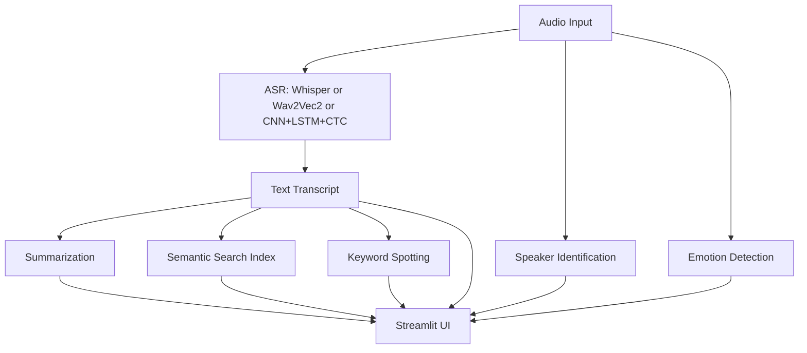

# System Architecture

## Core Notes
- The system separates speech recognition from downstream NLP/audio analytics.
- This allows benchmarking multiple ASR engines using the same evaluation and UI.
- Advanced tasks can be turned on/off independently for ablation experiments.
